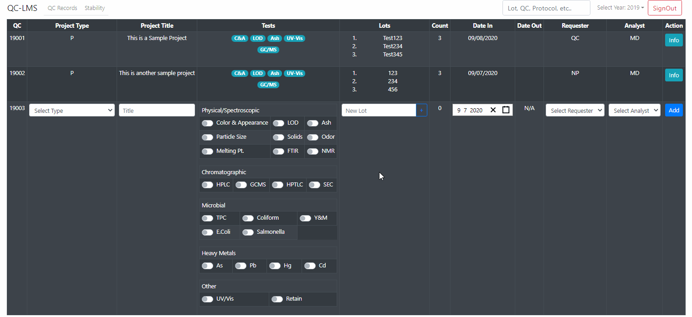
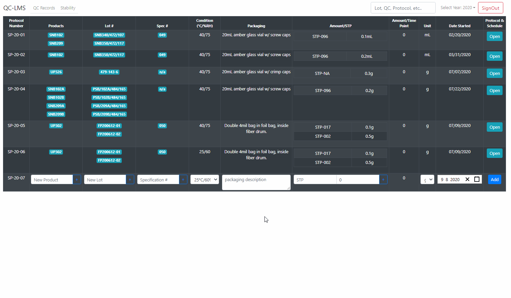
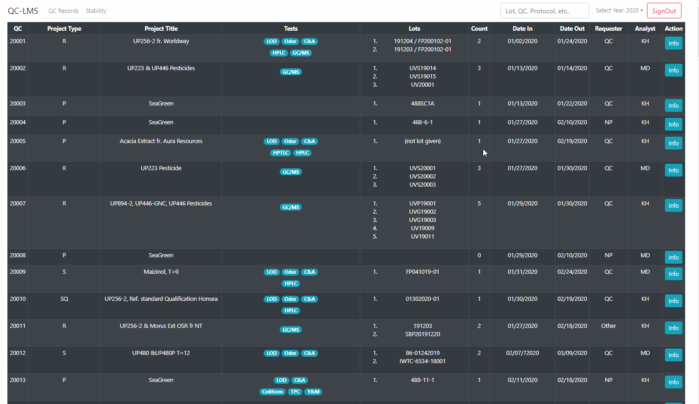
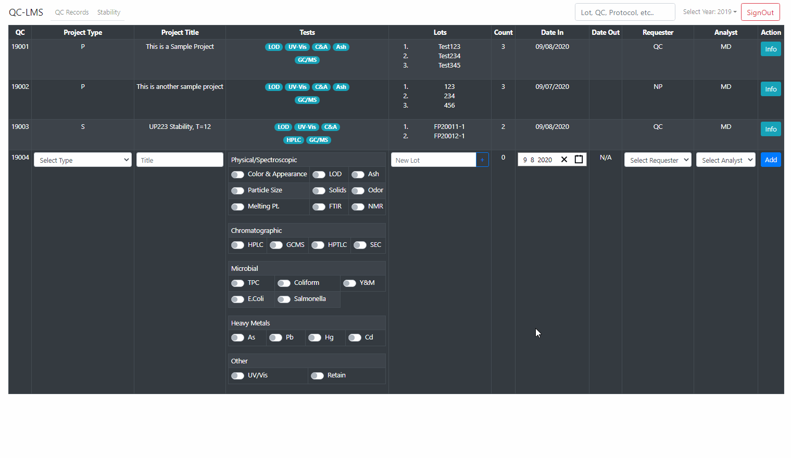
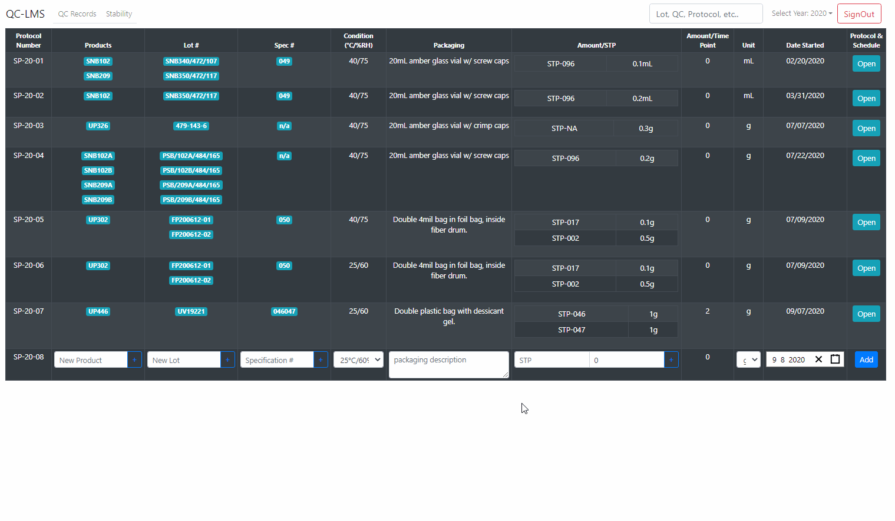

## QC-LMS (Quality Control - Lab Management System)

This project was built out of necessity to maintain optimal operation in our laboraroty. Since the COVID-19 pandemic, majority of our science heads are staying home. This application solves several issues in the lab: 

1. Since we no longer can keep multiple scientists in the lab at one time, it has become an issue of organization. The app allows each scientist to easily assign and reassign particular tests depending on who is in the lab. 
2. Each scientist can now have access to all the hard copy information typically only available inside the lab. This makes it easier to do reporting, updating files and notes for an experiment.
3. Since the information is now stored in the cloud, we can now have access to this information, even when the company VPN is down. This does not solve all our issues, but it makes it easier to be organized when not all our tools are working correctly.
4. Our lab now also have SAFE access to electronic information on data that was exclusively hand written. We can now see all past data, and cross reference files with ease.

## Demo

Currently, a demo is under construction, and the application backend contains private information. However below are some of the features for the app.

### Adding QC files

### Adding Stability Protocols

### Searching by key word, lot, file number, etc.

### Updating a QC file

### Updating a Stability Protocol

## License

MIT License

Copyright (c) 2020 Mark Daniel Delgado

Permission is hereby granted, free of charge, to any person obtaining a copy
of this software and associated documentation files (the "Software"), to deal
in the Software without restriction, including without limitation the rights
to use, copy, modify, merge, publish, distribute, sublicense, and/or sell
copies of the Software, and to permit persons to whom the Software is
furnished to do so, subject to the following conditions:

The above copyright notice and this permission notice shall be included in all
copies or substantial portions of the Software.

THE SOFTWARE IS PROVIDED "AS IS", WITHOUT WARRANTY OF ANY KIND, EXPRESS OR
IMPLIED, INCLUDING BUT NOT LIMITED TO THE WARRANTIES OF MERCHANTABILITY,
FITNESS FOR A PARTICULAR PURPOSE AND NONINFRINGEMENT. IN NO EVENT SHALL THE
AUTHORS OR COPYRIGHT HOLDERS BE LIABLE FOR ANY CLAIM, DAMAGES OR OTHER
LIABILITY, WHETHER IN AN ACTION OF CONTRACT, TORT OR OTHERWISE, ARISING FROM,
OUT OF OR IN CONNECTION WITH THE SOFTWARE OR THE USE OR OTHER DEALINGS IN THE
SOFTWARE.
